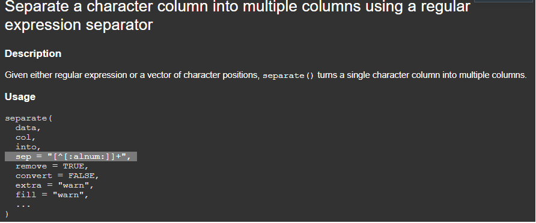

class: inverse, center, middle

```{r, include = FALSE}

library(tidyverse)
library(gt)
library(broom)
library(tblStrings)
library(glue)

knitr::opts_chunk$set(
  echo = TRUE,
  warning = FALSE,
  message = FALSE,
  fig.width = 12,
  fig.height = 5.5,
  dpi = 72 * 5
)

abpm_wide <- read_csv('data/abpm_wide_synthetic.csv') %>% 
  mutate(id = row_number())

```

# Separate

---
layout:true
background-image: url(img/tidyr.png)
background-size: 12.5%
background-position: 97.5% 2.5%

## Separate
---

We'll start with ambulatory BP monitoring demographics data:

```{r, echo = TRUE}

abpm_demo <- read_rds('data/abpm_demographics.rds')

abpm_demo

```

---

Use `separate()` to turn one column into 2 or more columns:

```{r}

abpm_demo %>% 
  separate(col = asr, into = c('age', 'sex', 'race')) #<<

```

---

Why did that work?

- `separate()` has a built-in default pattern that it searches for in the character designated as `col`. (more on patterns later)

```{r, out.width='100%', echo=FALSE}

```

---

but what if we had less tidy data to begin with?

```{r, echo = FALSE}

abpm_demo <- abpm_wide %>% 
  dplyr::select(id, age, sex, race) %>% 
  transmute(id, asr = glue("{age}_{sex}.junk.{race}"))

```

```{r}
abpm_demo
```

---

We'll need to do some cleaning before things work

```{r}
# won't work!
separate(abpm_demo, col = asr, into = c('age', 'sex', 'race'))

```

---

What can we do? Many things. How about two separates?

```{r}

# here's the first one
abpm_demo %>% 
  separate(col = asr, into = c('age', 'to_split'), sep = '_') #<<

```

---

What can we do? Many things. How about two separates?

```{r}

# and now the second
abpm_demo %>% 
  separate(asr, into = c('age', 'to_split'), sep = '_') %>% 
  separate(to_split, into = c('sex', 'race'), sep = '.junk.') #<<

```

---
layout: false
class: inverse, center, middle

# Unite

---
layout:true

background-image: url(img/tidyr.png)
background-size: 12.5%
background-position: 97.5% 2.5%

## Unite

---

`unite()` is simply the inverse of `separate()`. 

```{r}

abpm_wide %>% 
  select(age, sex, race) #<<

```

---

`unite()` is simply the inverse of `separate()`. 

```{r}

abpm_wide %>% 
  select(id, age, sex, race) %>% 
  unite(col = 'asr', age, sex, race, sep = '_') #<<

```

---
layout:false
class: inverse, center, middle

# But what about <br/>"[^[:alnum:]]+"?


---
layout:true

background-image: url(img/stringr.png)
background-size: 12.5%
background-position: 97.5% 2.5%

## Regular expressions and strings

---

A string is just a character value:

```{r}

string <- "A string for you"

writeLines(string)

```

---

What if you want to put a quote inside the string? <br/><br/>
Use the `\` symbol to escape it!

```{r}

string <- "A \"string\" for you"

writeLines(string)

```

But what if you want to write a \ in your string? Escape the escape!

```{r}

string <- "A \\backslash\\ for you"

writeLines(string)

```


---

So how about regular expressions?

- You can use these to match patterns in a string

- They take a bit of time to learn, but are worth it

Here is some motivation:

```{r}

some_strings <- c(
  "115 is a number", 
  "want another one? 3!", 
  "Okay, here is one more: 11"
)
  
```

How could we pull the numbers out of this string?

---

We could...

- remove all of the non-digit character

```{r}

str_remove_all(some_strings, pattern = '\\D')

```

---

We could...

- extract all of the digit characters

```{r}

str_extract_all(some_strings, pattern = '\\d')

```

---

But what if the numbers had a decimal? 

```{r}
tricky_strings <- c(
  'this number means business: 11.234',
  'and don\'t even get me started on 43.211'
)
```

---

We need to write a regular expression that will match

- one or more digits, followed by

- a decimal symbol, and then

- one or more digits

That is, "\\d+\\.?\\d+"

- "\\d+" detects one or more digits

- \\.? detects exactly one '.' symbol

---

Voila.

```{r}

str_extract_all(tricky_strings, "\\d*\\.?\\d+")

```

or, if you want a character vector:

```{r}
str_extract_all(tricky_strings, "\\d*\\.?\\d+") %>% 
  unlist()
```


---
layout:false 

## Learning more

To learn more, see

- This [vignette](https://tidyr.tidyverse.org/articles/pivot.html#introduction) dedicated to the `pivot_wider` and `pivot_longer` functions.


